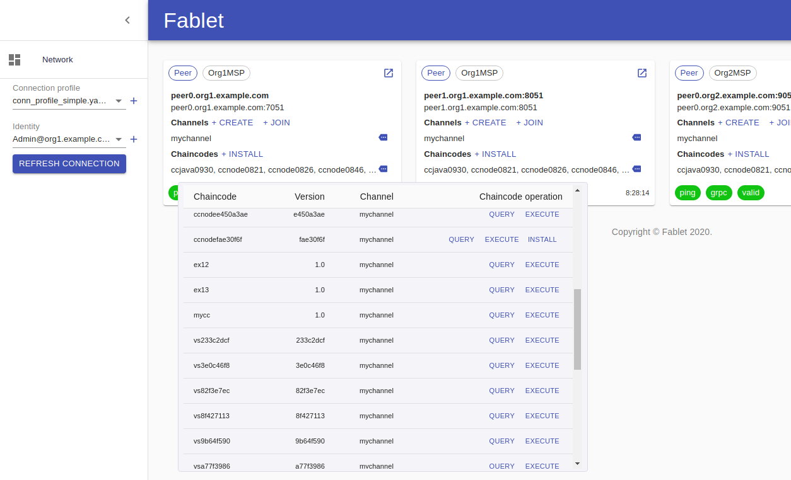
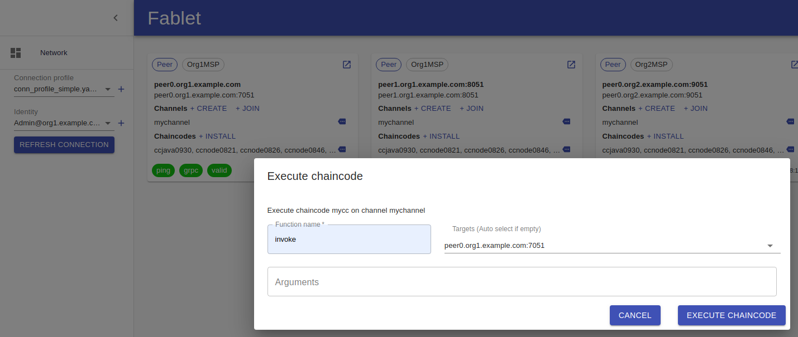
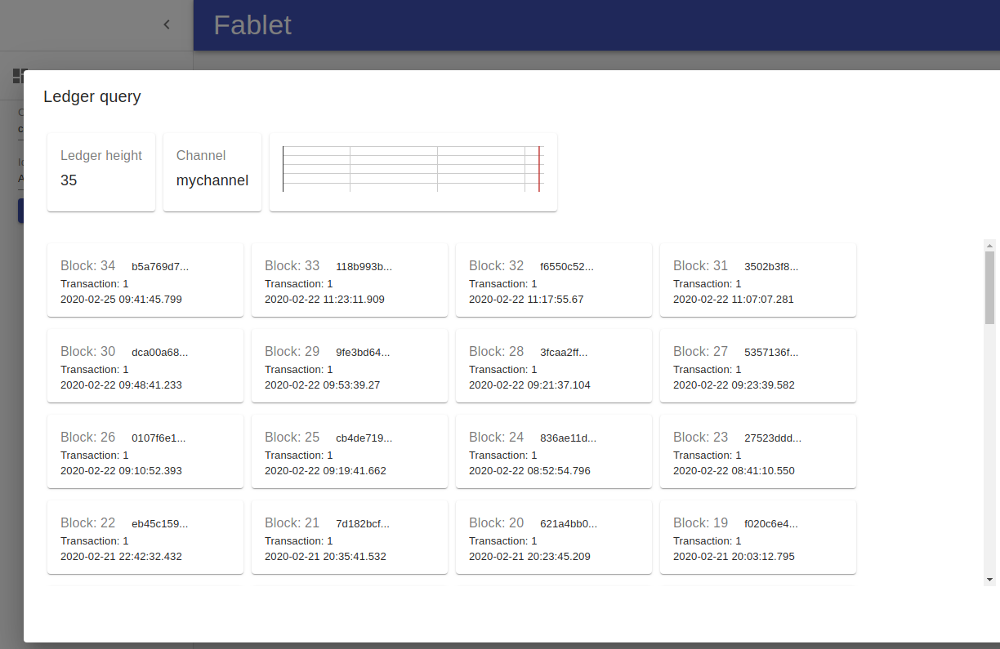

# Fablet
Fablet is a client tools set for Hyperledger Fabric blockchain platform.  
It can help blockchain participants to connect to Fabric network, and perform operations of chaincode, channel, ledger...  

### Peers list


### Chaincodes list


### Invoke chaincode


### Query ledger


# Playground
An example Fablet service was set up with a Fabric network, you can try it at:  
https://bctest01.fablet.pub:8081/  
*Due to the self-sign certificate, please accept the security exception in your browser.*

## Initial connection

If it is the first time you access the service, you need to create a connection profile and identity, we provide some examples corresponding to an example Fabric network (Fabric 1.4.3 first-network). Please download these accordinginly:  

* Connection Profile  
  https://bctest01.fablet.pub:8081/test/conn_profile_simple.yaml

* Identity certificate:  
  https://bctest01.fablet.pub:8081/test/Admin@org1.example.com-cert.pem  

* Identity private key:  
  https://bctest01.fablet.pub:8081/test/Admin@org1.example.com.key

* MSP ID  
  The corresponding MSP ID is `Org1MSP`

## Chaincode

### Installation
*An exmaple chaincode `vsinst` has already been instantiated.*  
*And you can also install another chaincode instance with below packages.*
*You can download the example package file and look into it for details.*

* Tar file  
  https://bctest01.fablet.pub:8081/test/vs_src.tar

* Tar.gz file (same with above but was compressed)  
  https://bctest01.fablet.pub:8081/test/vs_src.tar.gz

* Chaincode path  
  The corresponding chaincode path is `fablet/vs`.  

* Chaincode name and version  
  Please input name and version. Example is `vehiclesharing` and `1.0`.  

* *Another example Node chaincode package for Fablet. (Example02 from first-network)
  https://bctest01.fablet.pub:8081/test/example02node_src.tar*

### Instantiation 
*This is a lower machine, it might take several minutes...*
* Policy  
  ```
  OR ('Org1MSP.peer','Org2MSP.peer')
  ```

* Constructor parameters  
  For `vehiclesharing` example chaincode, please leave it as blank.

### Execution
* Function name
  ```
  createVehicle 
  ```

* Arguments
  ```
  v001,brand001
  ```
  
### Query
* Function name
  ```
  findVehicle 
  ```

* Arguments
  ```
  v001
  ```
  
*No more document for user now. I think that user should get all points from the UI directly, instead of documentation.*

# Build

## Prerequisite 

* Go ^1.13.4  
  If there is network issues, please try:  
  `go env -w GOPROXY=https://goproxy.io,direct`

* Node.js ^12.13.0

* yarn ^1.19.1  
  `npm install -g yarn`

* Hyperledger Fabric 1.4.3  
  Currently, Fablet supports Fabric 1.4.3, we are working to adapt to 2.0.0. Please refer to Fabric installation document for details.  

  *You can use Fablet to connect to an existing Fabric blockchain network.*

## Download repository

```
git clone https://github.com/IBM/fablet.git
```

## Build

* Build all
  ```
  ./build.sh
  ```

* Build service (go) project only
  ```
  ./build.sh service
  ```

* Build web (js/react) project only
  ```
  ./build web
  ```

## Start

The build output will be found at ./release/<OS_Arch>/fablet.

* Start Fablet as default with http on port 8080:
  ```
  ./release/<OS_Arch>/fablet
  ```

* Start Fablet with https on customized port 8081, and TCP address:  
  ```
  ./release/<OS_Arch>/fablet -addr localhost -port 8081 -cert <tls_cert> -key <tls_private_key>
  ```

When Fablet start, you can access it via browser (We tested it on Chrome and Firefox). For connection profile and identity encryption materials, please see section of 'Playground' for examples.

# Development

It is composed of 2 projects: service project and web project. These 2 projects folders can be opened as individual project, by MS Code or other IDE.

## Service project
Under folder `./`.  
It is developed in Go language, it provides web service, and html/js/image host.
* Run in development
  ```
  go run ./main
  ```
* Test  
  There are some testing programs in this project, before running those, you have to update connection profiles under folder `./test/connprofiles`.  
  Basically the profiles are suitable for the `fabric-samples/first-network` example Fabric network. Please update the `tlsCACerts` section in the connection profiles with the certificates, an example is `fabric-samples/first-network/crypto-config/peerOrganizations/org1.example.com/tlsca/tlsca.org1.example.com-cert.pem`.  

  If you want to use your self Fabric blockchain network for testing purposes, please update `tlsCACerts` with the certificates accordinginly.  

  These connection profiles can also be used to create connection to the Fabric blockchain network, via the Fablet web UI.  

## Web project
Under folder `./web`.  
It is developed in Javascript with React.

* Debug environment  
  Please open `./web/src/common/debugflag.js`, and then change const variable `DEBUG` to `true` in development.

* Dependencies
  ```
  yarn install
  ```

* Run in development
  ```
  yarn start
  ```
  Then open browser and access the default site: http://localhost:3000.
